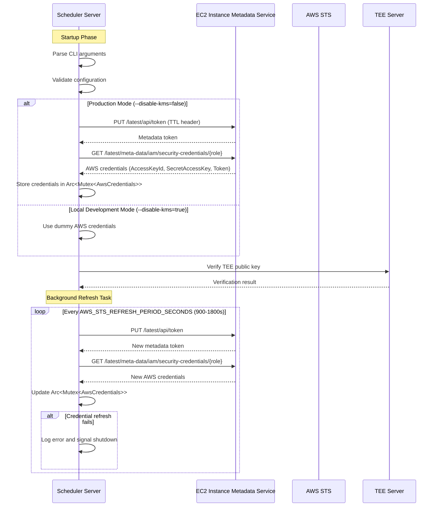

# AWS Credentials Management Flow

This document describes the AWS credentials management flow in the Shielder Scheduler Server.

## Sequence Diagram

## Key Components

- **EC2 Instance Metadata Service (IMDS)**: Provides temporary AWS credentials
- **Credential Rotation**: Automatic refresh every 15-30 minutes
- **Thread-Safe Storage**: Credentials stored in `Arc<Mutex<AwsCredentials>>`
- **Graceful Degradation**: Server shuts down if credential refresh fails
