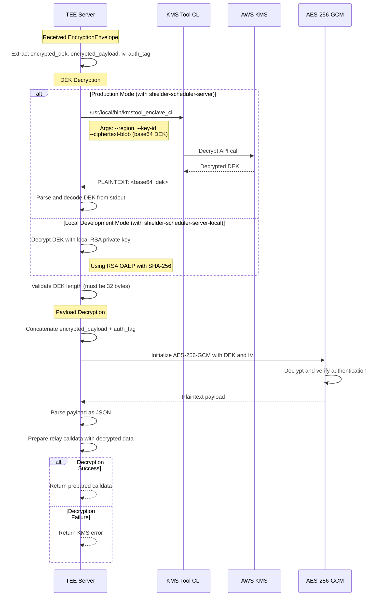

# KMS Decryption Flow in TEE

This document describes the KMS-based decryption process within the TEE.

## Sequence Diagram

## Security Features

- **Hardware Security**: Decryption occurs within AWS Nitro Enclave
- **Key Isolation**: DEK never exposed outside secure environment  
- **Authenticated Encryption**: AES-256-GCM provides integrity verification
- **Attestation**: Hardware attestation validates TEE authenticity
- **Local Development**: Safe local testing with separate key handling
