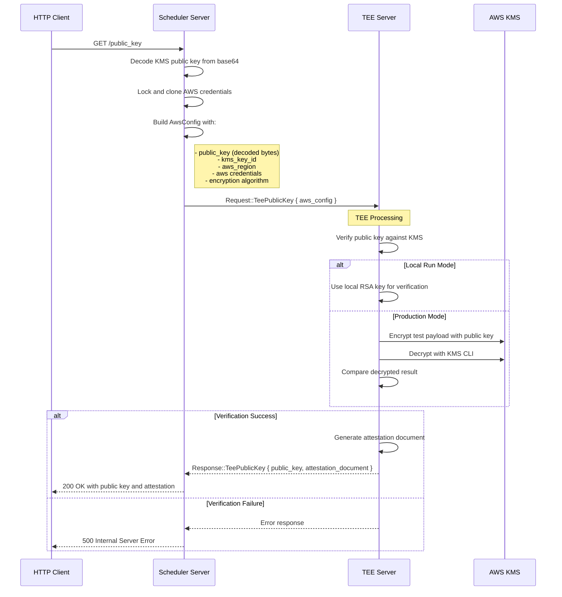

# TEE Public Key Verification Flow

This document describes the TEE public key verification process.

## Sequence Diagram

## Key Features

- **KMS Integration**: Verifies public key against AWS KMS
- **Attestation**: Returns hardware attestation document in production
- **Local Development**: Supports local RSA key verification
- **Security**: Validates KMS configuration before processing requests
