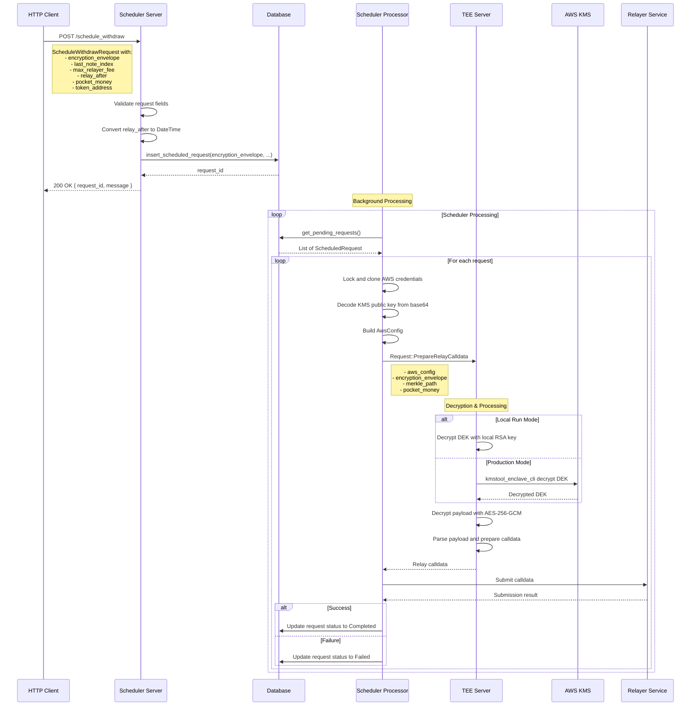

# Withdraw Request Processing Flow

This document describes the end-to-end withdraw request processing with KMS integration.

## Sequence Diagram

## Key Components

- **Encryption Envelope**: Contains encrypted payload, DEK, IV, and auth tag
- **KMS Integration**: Secure DEK decryption using AWS KMS
- **Database Persistence**: Stores encrypted data and request state
- **Background Processing**: Asynchronous request processing
- **Relayer Integration**: Submits prepared calldata to blockchain
